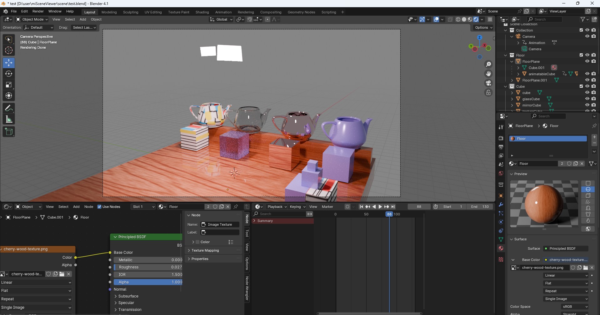

# Mitsube Scene Viewer and Generator(from blender)
# Mitsube Scene Viewer
Simple mitsube viewer in pygame.
- Integraor parameter control (SPP、depth...)
- Progress output (average output images)
- FLIP error map
- Animation
- Save image


## Run
`python ./main.py`

## Viewer Control
- `WASD`: fps control
- `QE`: Move up, down
- `R`: Reset position
- `Left mouse`: drag to control view direction
- `Esc`: Quit

# Mitsube Scene Generator (c++)
Convert gltf 2.0 to mitsube scene. 
gltf file can be exported from blender (.gltf + .bin + textures)
1. Object:
    Suppot object hierarchy. Multiple meshes (different materials in one object).
1. Material Support:
    Only supports Principled BSDF.
    Includes 
    - Base color (color3D or texture)
    - Metallic
    - Roughness
    - Transmission, and index of refraction (IOR).

2. Lighting Support:
    Only supports material emission (area light).

3. Camera Support:
    Only export camera pose. The views in blender and mitsuba may not match exactly.

4. Animation Support:
    Animated objects cannot have another animated object as their parent.
    Can animate to camera


## Run
- Install dependency `assimp`, `fmt` and `tinyxml2` which can be installed via `vcpkg`.
- Complie the file `miSceneExporter/gltf2miScene.cpp` using c++17.
- Run `gltf2miScene.exe path_to_gltf_file.gltf`.
- The result are in `output/` next to gltf file.
```
output
|- textures
    |- texture.png
|- models
    |- model.obj
|- scene.xml
|- animation.xml
```
